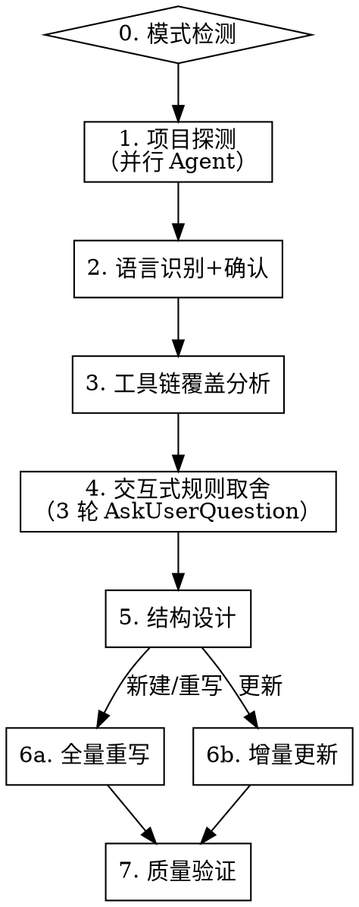

# 编写 CLAUDE.md

通过系统化方法论为项目生成高质量的 CLAUDE.md，确保 LLM 能最高效理解和遵守项目规范。

**核心原则：** 只写 agent 无法自行推断的内容。工具链已强制执行的不写，能从代码推断的不写，反直觉约束必须强调。

**方法论来源：** ETH Zurich ICML 2026 研究（arXiv:2602.11988）+ Stanford "Lost in the Middle"（arXiv:2307.03172）+ Anthropic 官方建议 + GitHub 2500+ 仓库分析

## 流程图



## 步骤 0：模式检测

检测项目根目录是否存在 CLAUDE.md 或 AGENTS.md：

- **不存在** → 直接进入步骤 1（创建模式）
- **已存在** → 用 AskUserQuestion 让用户选择：

```
Q0: "检测到已有 CLAUDE.md，如何处理？"
    选项:
    - 全量重写（从头分析，生成全新内容）
    - 增量更新（对比旧版，标记保留/删除/新增/合并）
```

现有文件内容仅作为参考对照，不限制思维。

## 步骤 1：项目探测

启动 1 个 Explore Agent，扫描项目根目录收集以下信息：

**必须收集：**
- 目录结构（`ls` + 关键子目录 `find`）
- 包管理配置（pyproject.toml / pom.xml / build.gradle / package.json / Cargo.toml / go.mod）
- Linter/Formatter 配置（ruff.toml / .eslintrc / checkstyle.xml / prettier.config / rustfmt.toml / .golangci.yml）
- pre-commit hooks（.pre-commit-config.yaml / husky / lint-staged）
- 测试配置（pytest.ini / jest.config / vitest.config）
- 质量门禁脚本（.quality_gate/ / scripts/ 中的自定义检查）

**可选收集：**
- CI/CD 配置（.github/workflows / .gitlab-ci.yml / Jenkinsfile）
- 已有 CLAUDE.md / AGENTS.md 内容

## 步骤 2：语言识别 + 框架检测

通过配置文件推断项目类型：

| 文件 | 推断 |
|------|------|
| pyproject.toml / setup.py / requirements.txt | Python |
| pom.xml / build.gradle(.kts) | Java |
| package.json（无 src/main/java） | 前端 |
| go.mod | Go |
| Cargo.toml | Rust |

从依赖声明推断框架：
- Python: FastAPI / Django / Flask
- Java: Spring Boot / Quarkus / Micronaut
- 前端: React / Vue / Svelte + Vite / Next.js / Nuxt
- Go: Gin / Echo / Fiber
- Rust: Actix / Axum / Tokio

**AskUserQuestion 确认：**

```
Q1: "检测到项目类型为 [语言/框架]，确认吗？"
    选项: 确认 / 不对，是其他类型
```

确认后加载对应的 `language-profiles/<lang>.md` 语言模板。

## 步骤 3：工具链覆盖分析

按照 `coverage-analyzer.md` 方法论，逐条检查语言模板中的候选规则：

```
对每条候选规则:
  已被工具链强制执行 → 标记"丢弃"
  反直觉约束 → 标记"必须强调"
  无覆盖且不可推断 → 标记"必须保留"
  有隐性知识 → 标记"保留+补充"
```

输出覆盖分析表，简要展示关键判定结果。

## 步骤 4：交互式规则取舍

**第一轮：核心架构**（AskUserQuestion，3 个问题）

```
Q2: "项目是否采用分层架构？"
    选项: DDD/Clean Architecture / MVC / 简单分层(无严格约束) / 无特定架构
Q3: "依赖注入方式？"
    选项: 自动(框架管理) / 手动(工厂模式) / 无DI
Q4: "异常处理策略？"
    选项: 全局拦截(统一错误响应) / 各层独立处理 / 简单try-catch
```

**第二轮：代码规范**（AskUserQuestion，3 个问题）

```
Q5: "是否有同步/异步架构约束？"
    选项: 全同步 / 全异步 / 混合(无约束)
Q6: "测试策略？"
    选项: TDD优先 / 测试覆盖要求 / 最小测试 / 无特殊要求
Q7: "是否有安全/边界校验要求？"
    选项: 严格边界校验 / 基本校验 / 无特殊要求
```

**第三轮：项目特有规则**（AskUserQuestion，1 个开放问题）

```
Q8: "有哪些项目特有的、不显而易见的规则？
     (如: 禁止某个API、特定命名约定、维护同步义务、质量门禁等)"
    → 开放输入，用户可跳过
```

## 步骤 5：结构设计

按照 `structure-guide.md` 设计输出结构：

```
首位效应（开头 — 注意力最高）
├── 项目身份（1-2 句话）
├── 适用范围（表格，可选）
├── 命令（表格）
└── 核心架构规则（图+表+✅/❌示例）

中间区域（注意力低谷）
├── 代码风格
├── 测试规范
├── 维护义务

近因效应（结尾 — 注意力回升）
├── 配置层级（如有）
└── 红线回顾（一句话复述最关键规则）
```

行数目标：≤ 200 行，理想 120-150 行。

## 步骤 6a：全量重写

加载语言模板 + 覆盖分析结果 + 用户交互答案，生成完整 CLAUDE.md。

**措辞规则：**
- 硬约束：`禁止` / `必须` / `唯一`
- 软约束：`推荐` / `建议` / `优先`
- 每个核心规则配 `✅/❌` 代码示例
- 表格替代散文
- 说明"为什么"（帮助模型在边界情况泛化）

## 步骤 6b：增量更新

对比现有 CLAUDE.md 与分析结果，输出差异建议表：

| 旧版内容 | 工具链覆盖 | 建议 | 原因 |
|----------|-----------|------|------|
| （旧版具体规则） | （覆盖工具或"无"） | 保留/删除/新增/合并 | （理由） |

用户确认后合并生成新版本。

## 步骤 7：质量验证

生成后逐项检查并报告：

1. **行数** ≤ 200 行？
2. **首位效应**：开头是否有命令 + 核心架构？
3. **近因效应**：结尾是否有红线回顾？
4. **代码示例**：核心规则是否有 ✅/❌？
5. **冗余**：是否有工具链已覆盖但仍写入的规则？

如有问题，提示用户修复。

## 生成完成后

输出 CLAUDE.md 内容并提示用户：
- 文件路径
- 总行数
- 质量验证结果摘要
- 建议用户在新会话中测试效果

## 交叉引用

- **工具链覆盖分析方法**：`coverage-analyzer.md`
- **结构设计指南**：`structure-guide.md`
- **语言模板**：`language-profiles/<lang>.md`
