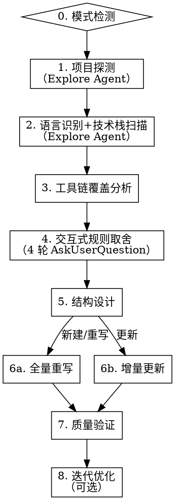

# 编写 CLAUDE.md

通过系统化方法论为项目生成高质量的 CLAUDE.md，确保 LLM 能最高效理解和遵守项目规范。

**核心原则：** 只写 agent 无法自行推断的内容。工具链已强制执行的不写，能从代码推断的不写，已有文档覆盖的不重复，反直觉约束必须强调。

**方法论来源：** ETH Zurich ICML 2026（arXiv:2602.11988）+ Stanford "Lost in the Middle"（arXiv:2307.03172）+ Anthropic Context Engineering + CodeIF-Bench（arXiv:2503.22688）+ AGENTS.md Linux Foundation 标准

**量化证据：**
- LLM 生成的上下文文件平均降低成功率 3%，增加推理成本 20%+（ETH 研究）
- 冗余是主因：移除项目已有文档后，上下文文件才显示正面效果
- 多轮交互中指令遵循面临挑战（CodeIF-Bench）

## 流程图



## 步骤 0：模式检测

检测项目根目录是否存在 CLAUDE.md / AGENTS.md / GEMINI.md：

- **不存在** → 直接进入步骤 1（创建模式）
- **已存在** → 用 AskUserQuestion 让用户选择：

```
Q0: "检测到已有 [文件名]，如何处理？"
    选项:
    - 全量重写（从头分析，生成全新内容）
    - 增量更新（对比旧版，标记保留/删除/新增/合并）
```

同时检查是否存在跨工具互操作需求（同时使用多种 AI 编码工具），记录备用。

现有文件内容仅作为参考对照，不限制思维。

## 步骤 1：项目探测

启动 1 个 Explore Agent，扫描项目根目录收集以下信息：

**必须收集：**
- 目录结构（`ls` + 关键子目录 `find`）
- 包管理配置文件识别（仅确认 pyproject.toml / pom.xml / build.gradle / package.json / Cargo.toml / go.mod 哪些存在，内容由步骤 2 技术栈扫描读取）
- Linter/Formatter 配置（ruff.toml / .eslintrc / checkstyle.xml / prettier.config / rustfmt.toml / .golangci.yml）
- pre-commit hooks（.pre-commit-config.yaml / husky / lint-staged）
- 测试配置（pytest.ini / jest.config / vitest.config）
- 质量门禁脚本（.quality_gate/ / scripts/ tests/ test/ 中的自定义检查）

**必须收集（冗余源）：**
- README.md 内容（标记为冗余源，后续不重复写入）
- docs/ 目录内容概览（标记为冗余源）
- CONTRIBUTING.md / DEVELOPMENT.md 等开发文档（标记为冗余源）
- 现有 CLAUDE.md / AGENTS.md 内容

**可选收集：**
- CI/CD 配置（.github/workflows / .gitlab-ci.yml / Jenkinsfile）

## 步骤 2：语言识别 + 技术栈扫描

通过配置文件推断项目类型：

| 文件 | 推断 |
|------|------|
| pyproject.toml / setup.py / requirements.txt | Python |
| pom.xml / build.gradle(.kts) | Java |
| package.json（无 src/main/java） | 前端 |
| go.mod | Go |
| Cargo.toml | Rust |

**AskUserQuestion 确认：**

```
Q1: "检测到项目语言为 [语言]，确认吗？"
    选项: 确认 / 不对，是其他类型

[语言] 仅填语言名（如 Java/Python/Go），不含框架版本号。版本信息由技术栈扫描产出。
```

确认后加载对应的 `references/<lang>.md` 语言参考资料。

**技术栈扫描：** 加载参考资料后，启动 1 个 Explore Agent，按参考资料中"检测信号"表逐行扫描项目。检测信号表的三列（技术栈 / 检测文件或模式 / 检测关键字）即扫描指令：

| 扫描源 | 方法 | 覆盖信号类型 |
|--------|------|-------------|
| 包管理配置文件（步骤 1 识别路径） | 读取内容匹配依赖声明中的关键字 | 依赖声明类（如 `seata-spring-boot-starter`） |
| 配置文件（application.yml / bootstrap.yml / .env / config.toml 等） | 读取内容匹配关键字 | 配置项类（如 `spring.datasource.url` 含 `mysql`） |
| 源码 | grep 注解、类名、import、Bean 定义等模式 | 源码模式类（如 `TransactionInterceptor` / `@EnableCaching`） |
| 目录结构 | find 特定目录或文件模式 | 目录信号类（如 `db/migration/` / `templates/`） |

输出**已检测技术栈清单**（如 "Spring Boot + MySQL + MyBatis + Seata + Redis + Nacos + Resilience4j"），供步骤 3 前置检查使用。

若 `references/<lang>.md` 不存在（如 Kotlin/Scala 等非预设语言）：
- 不报错，跳过技术栈扫描，改为从步骤 1 的探测结果推断语言特性
- 跳过步骤 3 中对语言参考文件的 Tier 判定，仅基于工具链覆盖分析生成规则
- 在步骤 6a 生成时，从项目代码结构中提取语言特有模式（如 Kotlin data class、coroutines 等）

## 步骤 3：工具链覆盖分析（渐进式披露）

按照 `coverage-analyzer.md` 方法论，**按 Tier 优先级分层处理**语言参考资料中的候选规则。

**前置检查：** 根据步骤 2 技术栈扫描输出的已检测技术栈清单，判定每条候选规则依赖的技术栈是否被检测到。未检测到的技术栈对应规则标记"不适用"（跳过）。

```
第一轮：Tier 1 核心规则（直接纳入）
  对每条 Tier 1 规则:
    项目未使用相关框架/工具 → 标记"不适用"（跳过）
    已有文档覆盖 → 标记"冗余: 引用文档路径"
    工具链覆盖且反直觉 → 标记"必须强调"
    工具链覆盖且不反直觉 → 标记"丢弃"
    无覆盖 → 标记"必须保留"
  → 通过检查的 Tier 1 规则跳过步骤 4 的用户取舍，直接进入步骤 5

第二轮：Tier 2 推荐规则（条件纳入）
  对每条 Tier 2 规则:
    项目未使用相关框架/工具 → 标记"不适用"（跳过）
    运行覆盖分析判定树 → 标记判定结果
  → 等待步骤 4 的用户回答决定是否激活
  → Tier 2 规则与步骤 4 的问题对应关系：
    Q2（分层架构）→ 分层约束、组合根规则
    Q3（DI 方式）→ DI 注入规则
    Q4（异常处理）→ 异常三阶段
    Q5（通用类库）→ 动态分析用户提供的类库源码，提取使用约定（非预定义 Tier 2 规则）
    Q6（同步/异步）→ async/同步架构规则
    Q7（测试策略）→ 测试框架规则
    Q8（安全/边界）→ 路径校验、ID 校验、API 枚举约束
  → 无 Q&A 映射的 Tier 2 规则（如日志规范）归入 Tier 2 通用池，
    在步骤 6a 中已生成内容 < 120 行时纳入

第三轮：Tier 3 边缘规则（按需纳入）
  对每条 Tier 3 规则:
    项目未使用相关框架/工具 → 标记"不适用"（跳过）
    仅运行覆盖分析，标记结果
  → 默认不纳入，除非步骤 4 Q9 中用户主动提及
  → 已生成内容 < 120 行且规则高度相关时可考虑纳入（见步骤 6a）
  → 空间不足时 Tier 3 优先被裁剪
```

输出分层覆盖分析表，按 Tier 分组展示关键判定结果。

## 步骤 4：交互式规则取舍

**第一轮：核心架构**（AskUserQuestion，3 个问题）

基于步骤 1 的探测结果和步骤 2 的技术栈扫描结果，预分析架构现状：
- 分层模式（Python: domain/application → DDD，Java: controllers/models → MVC，前端: pages/components + services → 简单分层，Go/Rust: cmd/ + internal/ → 简单分层，无分层目录 → 无架构）
- DI 方式（Java: Spring @Autowired / CDI，Python: dishka / FastAPI Depends，前端: React Context / Vue provide-inject，Go: wire / dig，Rust: trait + Box<dyn>，工厂类 → 手动，无 DI 框架）
- 异常策略（Java: @ControllerAdvice / ResponseEntityExceptionHandler，Python: @app.exception_handler / FastAPI HTTPException，前端: ErrorBoundary / 全局 catch，Go: panic/recover / error return，Rust: Result<T,E> / thiserror，零统一处理）

用作 Q2/Q3/Q4 的第一个选项。

`[检测结果]` 选项格式：label 写 `检测值（当前现状）`（如"DDD（当前现状）"），**禁止追加 "(Recommended)"**——检测值是现状陈述而非推荐。其他选项可正常使用 "(推荐)"。

```
Q2: "项目是否采用分层架构？"
    选项: [检测结果]（如"DDD: domain/application/infrastructure 分层"） / DDD/Clean Architecture / 简单分层(无严格约束) / 无特定架构
Q3: "依赖注入方式？"
    选项: [检测结果]（如"自动: Spring @Autowired"） / 自动(框架管理) / 手动(工厂模式) / 无DI管理
Q4: "异常处理策略？"
    选项: [检测结果]（如"全局拦截: @ControllerAdvice 统一错误响应"） / 全局拦截(统一错误响应) / 各层独立处理 / 简单try-catch
```

**第二轮：通用类库探测**（AskUserQuestion，1 个问题）

```
Q5: "项目是否依赖团队/公司级通用类库或组件？若存在请输入相关内容
     （如统一异常处理、日志组件、认证中间件、内部 SDK 等）"
    选项: 无，跳过 / 有，请自行探测
```

- 用户选"无，跳过" → 跳过通用类库规则
- 用户选"有，请自行探测" → 启动 Explore Agent 扫描项目依赖和代码结构，自动识别内部类库
- 用户选 Other 并提供源码路径或依赖标识 → 启动 Explore Agent 针对性分析指定目标

Explore Agent 分析提取：
- 库名、用途、强制性约定（必须/禁止）、初始化模式、配置规则
- 输出通用类库规范摘要，纳入 Tier 2 条件纳入池

**第三轮：代码规范**（AskUserQuestion，3 个问题）

基于步骤 1 的探测结果和步骤 2 的技术栈扫描结果，预分析代码规范现状：
- 同步/异步现状（Python: async/await，Java: CompletableFuture/AsyncContext，前端: Promise/async-await，Go: goroutine/channel，Rust: tokio::spawn/async fn）
- 测试现状（Python: pytest-cov + fixture 密度，Java: JUnit5 + 测试结构对称性，前端: vitest/jest + testing-library，Go: go test + table-driven，Rust: cargo test + proptest）

用作 Q6/Q7 的第一个选项。`[检测结果]` 选项格式同第一轮：label 写 `检测值（当前现状）`，**禁止追加 "(Recommended)"**——检测值是现状陈述而非推荐。其他选项可正常使用 "(推荐)"。

```
Q6: "是否有同步/异步架构约束？"
    选项: [检测结果]（如"全异步: async def + await + asyncio.run"） / 全同步 / 混合(无约束)

注意：若用户回答"全同步"但步骤 2 技术栈扫描检测到天然异步框架（FastAPI/Node/Actix 等），步骤 6a 仍会写入 async 规则（标注反直觉约束），此处不做跳过判定。

Q7: "测试策略？"
    选项: [检测结果]（如"覆盖要求: pytest-cov ≥ 80%"） / TDD优先 / 测试覆盖要求 / 最小测试 / 无特殊要求
Q8: "是否有安全/边界校验要求？"
    选项: 严格边界校验 / 基本校验 / 无特殊要求
```

**第四轮：项目特有规则**（AskUserQuestion，1 个开放问题）

```
Q9: "有哪些项目特有的、不显而易见的规则？
     (如: 禁止某个API、特定命名约定、维护同步义务、质量门禁等)"
    → 开放输入，用户可跳过
```

## 步骤 5：结构设计

按照 `structure-guide.md` 的输出骨架设计结构。**每个 section 有必选/条件选标记和最低行数**，LLM 严格按骨架逐段填充。

```
首位效应（开头 — 注意力最高）
├── 项目身份（含标题）                [必选，~3 行]
├── 适用范围                          [必选，≥3 行]
├── 命令                              [必选，≥5 行]
├── 核心架构规则（图+表+✅/❌示例）    [必选，≥15 行]
└── 通用类库依赖                      [条件选：Q5 有输入时，≥5 行]

中间区域（注意力低谷）
├── 代码风格                          [必选，≥10 行]
├── 测试规范                          [必选，≥8 行]
├── 维护义务                          [条件选：Q9 提及时，≥5 行]

重复强化（结尾 — 红线回顾）
├── 配置层级                          [可选，≥3 行]
└── 红线回顾                          [必选，2-3 行]
```

**行数目标：150-200 行。** 必选 section 最低合计 ~46 行，不足 150 行时按 `structure-guide.md` 的"行数扩展规则"依次扩展。

**模块化判断：**
- 预估行数 > 200 行 → 建议使用 `@path` import 拆分
- Monorepo 项目 → 建议嵌套 CLAUDE.md 策略
- 有 canonical example 文件 → 使用引用文件模式（"See X for canonical Y"）

**互操作判断：**
- 用户使用多种 AI 编码工具 → 建议以 AGENTS.md 为基础，symlink CLAUDE.md

## 步骤 6a：全量重写

按 Tier 优先级分层生成 CLAUDE.md：

```
第一层：Tier 1 规则（必须纳入）
  → 步骤 3 中判定为"必须保留"/"必须强调"的 Tier 1 规则全部写入
  → 配 ✅/❌ 代码示例
  → 放在首位效应区域（开头）

第二层：Tier 2 规则（条件纳入）
  → 仅纳入步骤 4 用户回答激活的 Tier 2 规则

  Q&A → Tier 2 激活映射表：
  | 问题 | 激活（写入规则） | 跳过 |
  |------|-----------------|------|
  | Q2 分层 | [检测结果] / DDD/Clean Architecture / 简单分层(无严格约束) → 写入对应分层约束规则 | 无特定架构 |
  | Q3 DI | [检测结果] 自动/手动 → 写入对应 DI 注入规则 | [检测结果] 无DI / 无DI |
  | Q4 异常 | [检测结果] 全局拦截/各层独立 → 写入对应异常处理规则 | [检测结果] 简单try-catch / 简单try-catch |
  | Q5 通用类库 | 有，请自行探测 / Other | 无，跳过 |
  | Q6 异步 | [检测结果] 全异步等 → 写入 async/同步规则；[检测结果] 全同步 + 天然异步框架（FastAPI/Node/Actix）→ 仍写入 async 规则（标注反直觉） | [检测结果] 全同步（非异步框架）/ 全同步 / 混合(无约束) |
  | Q7 测试 | [检测结果] TDD/覆盖要求 → 写入对应测试框架规则 | [检测结果] 最小测试 / 最小测试 / 无特殊要求 |
  | Q8 安全 | 严格边界校验 | 基本校验 / 无特殊要求 |

  Q5 细化：
  → Q5 选"有，请自行探测" → 纳入 Explore Agent 自动识别的类库规范摘要，放入首位效应区域
  → Q5 选 Other（提供了路径或标识）→ 纳入针对性分析的类库规范摘要，放入首位效应区域

  无 Q&A 映射的 Tier 2 规则（通用池）：行数 < 120 行时纳入，否则跳过
  → 放在中间区域

第三层：Tier 3 规则（按需纳入）
  → 仅在步骤 4 Q9 中用户主动提及时纳入
  → 或者行数仍有余量（< 120 行）且规则高度相关时考虑
  → 放在中间区域末尾

行数预算分配（目标 150-200 行）：
  标题 + 项目身份：~3 行
  适用范围：~3-5 行
  命令表：~5-10 行
  核心架构规则（Tier 1 + Tier 2 激活）：~30-50 行
  通用类库依赖（Q5 激活时）：~5-10 行
  代码风格：~10-20 行
  测试规范：~8-20 行
  维护义务（Q9 提及时）：~5-15 行
  配置层级（如有）：~3-5 行
  红线回顾：~2-3 行
  总计 150-200 行
  → 不足 150 行时：扩展代码示例 → 扩展测试 → 扩展代码风格 → 添加架构图
```

**措辞规则：**
- 硬约束：`禁止` / `必须` / `唯一`
- 软约束：`推荐` / `建议` / `优先`
- 每个核心规则配 `✅/❌` 代码示例
- 表格替代散文
- 说明"为什么"（帮助模型在边界情况泛化）

**去冗余规则：**
- 不重复 README/docs 中的内容，改用引用路径
- 不写入工具链已强制执行的规则（除非反直觉）
- 不写入 agent 可从代码推断的信息

## 步骤 6b：增量更新

对比现有 CLAUDE.md 与分析结果，输出差异建议表：

| 旧版内容 | 已有文档覆盖 | 工具链覆盖 | 建议 | 原因 |
|----------|-------------|-----------|------|------|
| （旧版具体规则） | （覆盖文档或"无"） | （覆盖工具或"无"） | 保留/删除/新增/合并 | （理由） |

用户确认后合并生成新版本。

## 步骤 7：质量验证

按照 `structure-guide.md`「质量验证清单」逐项检查并报告。如有问题，提示用户修复。

## 步骤 8：迭代优化（可选但推荐）

```
AskUserQuestion:
  "建议在新会话中测试生成的 CLAUDE.md 效果。
   测试方法：用新会话执行一个典型开发任务，观察 agent 是否违反关键规则。
   是否需要现在进行迭代优化？"
    选项:
    - 完成，我先测试
    - 是的，我有反馈需要调整
```

**迭代原则（Anthropic Context Engineering）：**
- 从最小指令集开始
- 根据实际失败模式添加规则
- 每次只添加验证为必要的最小指令
- 避免预判所有边缘情况

## 生成完成后

输出 CLAUDE.md 内容并提示用户：
- 文件路径
- 总行数
- 质量验证结果摘要
- 如适用：import 拆分建议、跨工具复用建议
- 建议用户在新会话中测试效果

## 交叉引用

- **工具链覆盖分析方法**：`coverage-analyzer.md`
- **结构设计指南**：`structure-guide.md`
- **语言参考资料**：`references/<lang>.md`
- **测试场景**：`tests/scenarios.md`（修改技能后逐场景验证）
