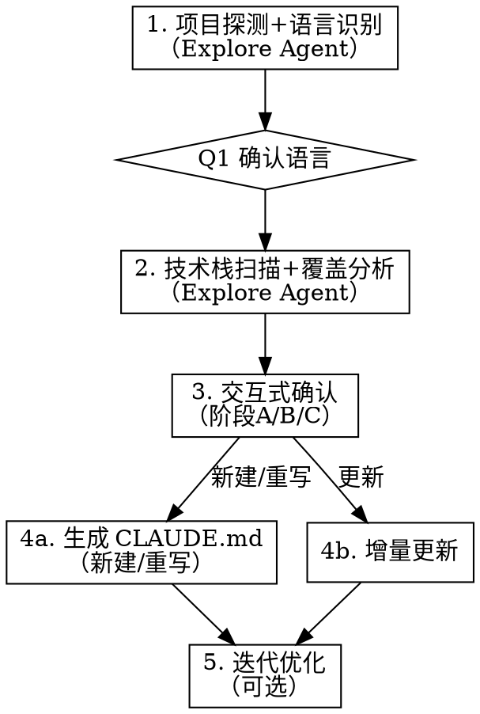

# 编写 CLAUDE.md

通过系统化方法论为项目生成高质量的 CLAUDE.md，确保 LLM 能最高效理解和遵守项目规范。

**核心原则：** 只写 agent 无法自行推断的内容。工具链已强制执行的不写，能从代码推断的不写，已有文档覆盖的不重复，反直觉约束必须强调。

**方法论来源：** ETH Zurich ICML 2026（arXiv:2602.11988）+ Stanford "Lost in the Middle"（arXiv:2307.03172）+ Anthropic Context Engineering + CodeIF-Bench（arXiv:2503.22688）+ AGENTS.md Linux Foundation 标准

**量化证据：**
- LLM 生成的上下文文件平均降低成功率 3%，增加推理成本 20%+（ETH 研究）
- 冗余是主因：移除项目已有文档后，上下文文件才显示正面效果
- 多轮交互中指令遵循面临挑战（CodeIF-Bench）

## 流程图



## 步骤 1：项目探测 + 语言识别

**模式检测：** 检测项目根目录是否存在 CLAUDE.md / AGENTS.md / GEMINI.md：
- **不存在** → 新建模式
- **已存在** → 记录为更新模式，同时检查是否存在跨工具互操作需求（同时使用多种 AI 编码工具）

现有文件内容仅作为参考对照，不限制思维。

启动 1 个 Explore Agent，扫描项目根目录收集以下信息：

**必须收集：**
- 目录结构（`ls` + 关键子目录 `find`）
- 包管理配置文件（识别存在性 **+ 读取内容**，供步骤 2 直接使用）
  - pyproject.toml / setup.py / requirements.txt / pom.xml / build.gradle(.kts) / package.json / Cargo.toml / go.mod
- Linter/Formatter 配置（ruff.toml / .eslintrc / checkstyle.xml / prettier.config / rustfmt.toml / .golangci.yml）
- pre-commit hooks（.pre-commit-config.yaml / husky / lint-staged）
- 测试配置（pytest.ini / jest.config / vitest.config）
- 质量门禁脚本（.quality_gate/ / scripts/ tests/ test/ 中的自定义检查）

**必须收集（冗余源）：**
- README.md 内容（标记为冗余源，后续不重复写入）
- docs/ 目录内容概览（标记为冗余源）
- CONTRIBUTING.md / DEVELOPMENT.md 等开发文档（标记为冗余源）
- 现有 CLAUDE.md / AGENTS.md 内容

**可选收集：**
- CI/CD 配置（.github/workflows / .gitlab-ci.yml / Jenkinsfile）

**语言推断：** 基于收集到的包管理配置文件自动推断：

| 文件 | 推断 |
|------|------|
| pyproject.toml / setup.py / requirements.txt | Python |
| pom.xml / build.gradle(.kts) | Java |
| package.json（无 src/main/java） | 前端 |
| go.mod | Go |
| Cargo.toml | Rust |

Agent 同时输出：探测结果 + 语言推断。

**AskUserQuestion 确认：**

```
Q1: "检测到项目语言为 [语言]，确认吗？"
    选项: 确认 / 不对，是其他类型

[语言] 仅填语言名（如 Java/Python/Go），不含框架版本号。版本信息由技术栈扫描产出。
```

确认后加载对应的 `references/<lang>.md` 语言参考资料。

## 步骤 2：技术栈扫描 + 覆盖分析

加载语言参考资料后，启动 1 个 Explore Agent 扫描技术栈。

**扫描优化：** Agent 直接在步骤 1 已输出的配置文件内容上匹配依赖关键字，仅对源码模式和目录信号执行额外 grep/find。

| 扫描源 | 方法 | 覆盖信号类型 |
|--------|------|-------------|
| 步骤 1 已输出的配置文件内容 | 内容匹配关键字 | 依赖声明类（如 `seata-spring-boot-starter`） |
| 额外配置文件（application.yml / .env 等） | 读取内容匹配关键字 | 配置项类（如 `spring.datasource.url` 含 `mysql`） |
| 源码 | grep 注解、类名、import、Bean 定义等模式 | 源码模式类（如 `TransactionInterceptor` / `@EnableCaching`） |
| 目录结构 | find 特定目录或文件模式 | 目录信号类（如 `db/migration/` / `templates/`） |

输出**已检测技术栈清单**（如 "Spring Boot + MySQL + MyBatis + Seata + Redis + Nacos + Resilience4j"）。

若 `references/<lang>.md` 不存在（如 Kotlin/Scala 等非预设语言）：
- 不报错，跳过技术栈扫描，改为从步骤 1 的探测结果推断语言特性
- 跳过覆盖分析中的 Tier 判定，仅基于工具链覆盖分析生成规则
- 在步骤 4 生成时，从项目代码结构中提取语言特有模式（如 Kotlin data class、coroutines 等）

**覆盖分析：** 按照 `coverage-analyzer.md` 方法论，即时运行（无需额外 Agent），按 Tier 优先级分层处理语言参考资料中的候选规则。

**前置检查：** 根据已检测技术栈清单，判定每条候选规则依赖的技术栈是否被检测到。未检测到的技术栈对应规则标记"不适用"（跳过）。

```
第一轮：Tier 1 核心规则（直接纳入）
  对每条 Tier 1 规则:
    项目未使用相关框架/工具 → 标记"不适用"（跳过）
    已有文档覆盖 → 标记"冗余: 引用文档路径"
    工具链覆盖且反直觉 → 标记"必须强调"
    工具链覆盖且不反直觉 → 标记"丢弃"
    无覆盖 → 标记"必须保留"
  → 直接进入步骤 4 生成

第二轮：Tier 2 推荐规则（条件纳入）
  对每条 Tier 2 规则:
    项目未使用相关框架/工具 → 标记"不适用"（跳过）
    运行覆盖分析判定树 → 标记判定结果
  → 等待步骤 3 阶段 A 技术栈确认后决定是否激活
  → 无 Q&A 映射的 Tier 2 规则（如日志规范）归入 Tier 2 通用池，
    在步骤 4 中已生成内容 < 120 行时纳入

第三轮：Tier 3 边缘规则（按需纳入）
  对每条 Tier 3 规则:
    项目未使用相关框架/工具 → 标记"不适用"（跳过）
    仅运行覆盖分析，标记结果
  → 默认不纳入，除非步骤 3 阶段 C 中用户主动提及
  → 已生成内容 < 120 行且规则高度相关时可考虑纳入（见步骤 4）
  → 空间不足时 Tier 3 优先被裁剪
```

**候选推荐池：** 覆盖分析同时输出推荐建议候选：
- 标记为"丢弃"但属于最佳实践的规则（如"丢弃"因为工具链覆盖，但推荐显式声明加强规范）
- 检测到技术栈后发现的模式缺口（如有框架但无异常处理、有 Redis 但无 key 约定）
- 语言 reference 中与已检测技术栈相关但未采用的 Tier 2/3 规则

输出：**分层覆盖分析表** + **候选推荐池**。

## 步骤 3：交互式确认

### 阶段 A：技术栈事实确认

基于步骤 2 检测到的技术栈清单，按大类别分组展示，让用户确认哪些是实际在用的（修正误检）。

**AskUserQuestion（1-2 次调用，每次 ≤4 个问题）：**

按技术栈数量和类别数决定调用次数。基础类别固定为以下 4 个（空类别不展示）：

| 类别 | 包含内容 | 判定来源 |
|------|---------|---------|
| 框架与核心 | 语言框架、核心库（如 Spring Boot / FastAPI / Pydantic） | 依赖声明 + 源码模式 |
| 数据与存储 | 数据库、ORM、缓存、迁移工具（如 MySQL / MyBatis / Redis / Flyway） | 依赖声明 + 配置文件 + 目录信号 |
| 基础设施与中间件 | 服务注册、配置中心、消息队列、分布式事务（如 Nacos / Kafka / Seata） | 依赖声明 + 配置文件 |
| 开发工具与类库 | 测试框架、Lint 工具、日志库、内部类库（如 pytest / ruff / structlog） | 依赖声明 + 源码模式 |

**选项数限制：** 每个问题最多 4 个选项。当某类别检测到的技术栈 >4 项时，按职责拆分为子类别，确保每个子类别 ≤4 项。拆分规则：

| 父类别 | 拆分条件 | 子类别 |
|--------|---------|--------|
| 框架与核心 | >4 项 | Web 框架（如 Spring Boot / FastAPI） + 工具库（如 MapStruct / Lombok / Pydantic） |
| 数据与存储 | >4 项 | 数据库 + ORM（如 MySQL / MyBatis） + 缓存 + 迁移（如 Redis / Flyway） |
| 基础设施与中间件 | >4 项 | 服务治理（如 Nacos / Consul） + 消息 + 事务（如 Kafka / Seata） |
| 开发工具与类库 | >4 项 | 测试框架（如 JUnit5 / pytest） + 质量工具 + 内部类库（如 ruff / company-common-utils） |

拆分后的子类别各自占一个问题槽。总问题数可能超过 4 个时，分 2 次调用。

**问题格式（multiSelect）：**

```
A_[类别]: "请确认 [类别名] 中实际在用的技术（取消勾选误检项）："
    multiSelect: true
    options: [步骤 2 检测到的该（子）类别技术栈项，≤4 个]
```

示例（Java 项目，无超限）：
```
A1: "请确认框架与核心中实际在用的技术："
    multiSelect: true, options: Spring Boot, MapStruct

A2: "请确认数据与存储中实际在用的技术："
    multiSelect: true, options: MySQL, MyBatis, Redis, Flyway

A3: "请确认基础设施与中间件中实际在用的技术："
    multiSelect: true, options: Nacos, Seata

A4: "请确认开发工具与类库中实际在用的技术："
    multiSelect: true, options: JUnit5, Checkstyle, company-common-utils
```

示例（复杂 Java 项目，"框架与核心"超限拆分）：
```
A1: "请确认 Web 框架中实际在用的技术："
    multiSelect: true, options: Spring Boot, Spring Security, Spring Cloud

A2: "请确认工具库中实际在用的技术："
    multiSelect: true, options: MapStruct, Lombok
```

**用户取消勾选的项** → 步骤 2 覆盖分析中对应规则重新标记为"不适用"。

### 阶段 B：优化推荐

基于阶段 A 确认后的技术栈 + 步骤 2 候选推荐池，LLM 生成加强规范建议。

**LLM 推荐逻辑：**
- 分析确认技术栈的使用模式缺口（如框架存在但缺少统一异常处理）
- 从候选推荐池中筛选与已确认技术栈相关的建议
- 每条建议包含：现状描述 + 推荐动作 + 预期收益

**AskUserQuestion（1 次调用）：**

```
B1: "基于已确认技术栈，以下规范建议是否采纳？"
    multiSelect: true
    options:
    - "[现状] → [推荐动作]（如：检测到 FastAPI 但无全局异常拦截 → 建议添加统一异常处理）"
    - ...
```

若候选推荐池为空（技术栈使用完善），跳过阶段 B。

**用户采纳的推荐项** → 作为额外 Tier 2 规则纳入步骤 4 生成。

### 阶段 C：策略确认

仅保留无法从技术栈推断的策略选择和项目特有规则。

**AskUserQuestion（1 次调用，3 个问题）：**

```
C1: "测试策略？"
    选项: TDD优先 / 测试覆盖要求 / 最小测试 / 无特殊要求

C2: "安全/边界校验要求？"
    选项: 严格边界校验 / 基本校验 / 无特殊要求

C3: "有哪些项目特有的、不显而易见的规则？
     (如: 禁止某个API、特定命名约定、维护同步义务、质量门禁等)"
    → 开放输入，用户可跳过
```

阶段 C 收集的答案直接影响步骤 4 的生成内容：
- C1 测试策略 → 步骤 4 写入对应测试框架规则（TDD流程/覆盖要求/不写入）
- C2 安全边界 → 步骤 4 写入安全边界规则（严格校验/不写入）
- C3 项目规则 → 步骤 4 写入维护义务段 + Tier 3 激活

## 步骤 4：生成 CLAUDE.md

### 4a：全量重写（新建/重写模式）

**结构设计：** 按照 `structure-guide.md` 的输出骨架设计结构，LLM 严格按骨架逐段填充。

```
首位效应（开头 — 注意力最高）
├── 项目身份（含标题）                [必选，~3 行]
├── 适用范围                          [必选，≥3 行]
├── 命令                              [必选，≥5 行]
├── 核心架构规则（图+表+✅/❌示例）    [必选，≥15 行]
└── 通用类库依赖                      [条件选：阶段 A 确认有内部类库时，≥5 行]

中间区域（注意力低谷）
├── 代码风格                          [必选，≥10 行]
├── 测试规范                          [条件选：C1 非无特殊要求时，≥8 行]
├── 维护义务                          [条件选：C3 有输入时，≥5 行]

重复强化（结尾 — 红线回顾）
├── 配置层级                          [可选，≥3 行]
└── 红线回顾                          [必选，2-3 行]
```

**行数目标：150-200 行。** 不足 150 行时按 `structure-guide.md` 的"行数扩展规则"依次扩展。

**模块化判断：**
- 预估行数 > 200 行 → 建议使用 `@path` import 拆分
- Monorepo 项目 → 建议嵌套 CLAUDE.md 策略
- 有 canonical example 文件 → 使用引用文件模式

**互操作判断：**
- 步骤 1 检测到多种 AI 编码工具 → 建议以 AGENTS.md 为基础，symlink CLAUDE.md

**按 Tier 优先级分层生成：**

```
第一层：Tier 1 规则（必须纳入）
  → 步骤 2 中判定为"必须保留"/"必须强调"的 Tier 1 规则全部写入
  → 配 ✅/❌ 代码示例
  → 放在首位效应区域（开头）

第二层：Tier 2 规则（条件纳入）
  → 基于阶段 A 确认的技术栈，自动推断架构模式并写入对应规则：

  架构模式自动推断表：
  | 模式 | 推断来源 | 规则 |
  |------|---------|------|
  | 分层架构 | 目录结构（domain/application → DDD，controllers/models → MVC，cmd/+internal/ → 简单分层，无分层目录 → 无架构） | 写入对应分层约束规则 |
  | DI 方式 | 确认框架（Spring → 自动，dishka → 自动，wire/dig → 自动，工厂类 → 手动，无框架 → 无DI） | 写入对应 DI 注入规则 |
  | 异常处理 | 源码模式（@ControllerAdvice → 全局拦截，ErrorBoundary → 全局拦截，各层独立 try-catch → 各层独立，无统一处理 → 简单try-catch） | 写入对应异常处理规则 |
  | 同步/异步 | 确认框架（FastAPI/Node/Actix/Ktor → 天然异步，goroutine → 异步，其余 → 检查源码 async def / async fn / suspend fun） | 天然异步框架 + 全同步代码 → 写入 async 规则（标注反直觉）；全异步 → 不写入（非反直觉） |

  → 基于阶段 B 用户采纳的推荐项，写入对应加强规范
  → 无 Q&A 映射的 Tier 2 规则（通用池）：已生成内容 < 120 行时纳入，放在中间区域

第三层：Tier 3 规则（按需纳入）
  → 仅在阶段 C 中用户主动提及时纳入
  → 或者已生成内容 < 120 行且规则高度相关时考虑
  → 放在中间区域末尾

行数预算分配（目标 150-200 行）：
  标题 + 项目身份：~3 行
  适用范围：~3-5 行
  命令表：~5-10 行
  核心架构规则（Tier 1 + Tier 2 激活）：~30-50 行
  通用类库依赖（阶段 A 确认时）：~5-10 行
  代码风格：~10-20 行
  测试规范（C1 激活时）：~8-20 行
  维护义务（C3 有输入时）：~5-15 行
  配置层级（如有）：~3-5 行
  红线回顾：~2-3 行
  总计 150-200 行
  → 不足 150 行时：扩展代码示例 → 扩展测试 → 扩展代码风格 → 添加架构图
```

**措辞规则：**
- 硬约束：`禁止` / `必须` / `唯一`
- 软约束：`推荐` / `建议` / `优先`
- 每个核心规则配 `✅/❌` 代码示例
- 表格替代散文
- 说明"为什么"（帮助模型在边界情况泛化）

**去冗余规则：**
- 不重复 README/docs 中的内容，改用引用路径
- 不写入工具链已强制执行的规则（除非反直觉）
- 不写入 agent 可从代码推断的信息

**质量自检：** 按照 `structure-guide.md`「质量验证清单」逐项检查。如有问题，修正后重新检查。

### 4b：增量更新（更新模式）

对比现有 CLAUDE.md 与分析结果，输出差异建议表：

| 旧版内容 | 已有文档覆盖 | 工具链覆盖 | 建议 | 原因 |
|----------|-------------|-----------|------|------|
| （旧版具体规则） | （覆盖文档或"无"） | （覆盖工具或"无"） | 保留/删除/新增/合并 | （理由） |

用户确认后合并生成新版本。

**何时建议改为全量重写：** 旧版内容与 `structure-guide.md` 推荐结构差异过大时（如缺少核心 section、行数 < 50 或 > 300），提示用户考虑全量重写。

## 步骤 5：迭代优化（可选但推荐）

```
AskUserQuestion:
  "建议在新会话中测试生成的 CLAUDE.md 效果。
   测试方法：用新会话执行一个典型开发任务，观察 agent 是否违反关键规则。
   是否需要现在进行迭代优化？"
    选项:
    - 完成，我先测试
    - 是的，我有反馈需要调整
```

**迭代原则（Anthropic Context Engineering）：**
- 从最小指令集开始
- 根据实际失败模式添加规则
- 每次只添加验证为必要的最小指令
- 避免预判所有边缘情况

## 生成完成后

输出 CLAUDE.md 内容并提示用户：
- 文件路径
- 总行数
- 质量验证结果摘要
- 如适用：import 拆分建议、跨工具复用建议
- 建议用户在新会话中测试效果

## 交叉引用

- **工具链覆盖分析方法**：`coverage-analyzer.md`
- **结构设计指南**：`structure-guide.md`
- **语言参考资料**：`references/<lang>.md`
- **测试场景**：`tests/scenarios.md`（修改技能后逐场景验证）
