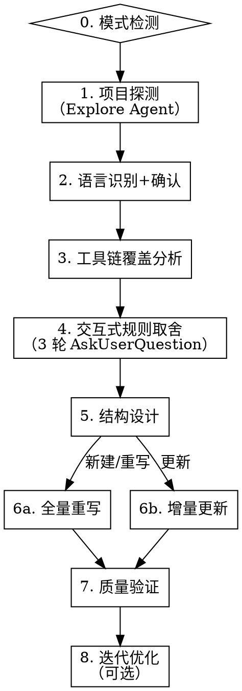

# 编写 CLAUDE.md

通过系统化方法论为项目生成高质量的 CLAUDE.md，确保 LLM 能最高效理解和遵守项目规范。

**核心原则：** 只写 agent 无法自行推断的内容。工具链已强制执行的不写，能从代码推断的不写，已有文档覆盖的不重复，反直觉约束必须强调。

**方法论来源：** ETH Zurich ICML 2026（arXiv:2602.11988）+ Stanford "Lost in the Middle"（arXiv:2307.03172）+ Anthropic Context Engineering + CodeIF-Bench（arXiv:2503.22688）+ AGENTS.md Linux Foundation 标准

**量化证据：**
- LLM 生成的上下文文件平均降低成功率 3%，增加推理成本 20%+（ETH 研究）
- 冗余是主因：移除项目已有文档后，上下文文件才显示正面效果
- 指令遵循随对话长度递减（CodeIF-Bench）

## 流程图



## 步骤 0：模式检测

检测项目根目录是否存在 CLAUDE.md / AGENTS.md / GEMINI.md：

- **不存在** → 直接进入步骤 1（创建模式）
- **已存在** → 用 AskUserQuestion 让用户选择：

```
Q0: "检测到已有 [文件名]，如何处理？"
    选项:
    - 全量重写（从头分析，生成全新内容）
    - 增量更新（对比旧版，标记保留/删除/新增/合并）
```

同时检查是否存在跨工具互操作需求（同时使用多种 AI 编码工具），记录备用。

现有文件内容仅作为参考对照，不限制思维。

## 步骤 1：项目探测

启动 1 个 Explore Agent，扫描项目根目录收集以下信息：

**必须收集：**
- 目录结构（`ls` + 关键子目录 `find`）
- 包管理配置（pyproject.toml / pom.xml / build.gradle / package.json / Cargo.toml / go.mod）
- Linter/Formatter 配置（ruff.toml / .eslintrc / checkstyle.xml / prettier.config / rustfmt.toml / .golangci.yml）
- pre-commit hooks（.pre-commit-config.yaml / husky / lint-staged）
- 测试配置（pytest.ini / jest.config / vitest.config）
- 质量门禁脚本（.quality_gate/ / scripts/ 中的自定义检查）

**必须收集（冗余源）：**
- README.md 内容（标记为冗余源，后续不重复写入）
- docs/ 目录内容概览（标记为冗余源）
- CONTRIBUTING.md / DEVELOPMENT.md 等开发文档（标记为冗余源）
- 现有 CLAUDE.md / AGENTS.md 内容

**可选收集：**
- CI/CD 配置（.github/workflows / .gitlab-ci.yml / Jenkinsfile）
- Monorepo 结构（nx.json / turborepo.json / Cargo workspace / Go workspace）

## 步骤 2：语言识别 + 框架检测

通过配置文件推断项目类型：

| 文件 | 推断 |
|------|------|
| pyproject.toml / setup.py / requirements.txt | Python |
| pom.xml / build.gradle(.kts) | Java |
| package.json（无 src/main/java） | 前端 |
| go.mod | Go |
| Cargo.toml | Rust |

从依赖声明推断框架：
- Python: FastAPI / Django / Flask
- Java: Spring Boot / Quarkus / Micronaut
- 前端: React / Vue / Svelte + Vite / Next.js / Nuxt
- Go: Gin / Echo / Fiber
- Rust: Actix / Axum / Tokio

**AskUserQuestion 确认：**

```
Q1: "检测到项目类型为 [语言/框架]，确认吗？"
    选项: 确认 / 不对，是其他类型
```

确认后加载对应的 `references/<lang>.md` 语言参考资料。

## 步骤 3：工具链覆盖分析（渐进式披露）

按照 `coverage-analyzer.md` 方法论，**按 Tier 优先级分层处理**语言参考资料中的候选规则。

**前置检查：** 根据步骤 1 收集的项目依赖和配置，确定项目实际使用的技术栈。规则依赖的框架/工具不在项目依赖中时，标记"不适用"。

```
第一轮：Tier 1 核心规则（直接纳入）
  对每条 Tier 1 规则:
    项目未使用相关框架/工具 → 标记"不适用"（跳过）
    已有文档覆盖 → 标记"冗余: 引用文档路径"
    工具链覆盖且反直觉 → 标记"必须强调"
    工具链覆盖且不反直觉 → 标记"丢弃"
    无覆盖 → 标记"必须保留"
  → 通过检查的 Tier 1 规则跳过步骤 4 的用户取舍，直接进入步骤 5

第二轮：Tier 2 推荐规则（条件纳入）
  对每条 Tier 2 规则:
    项目未使用相关框架/工具 → 标记"不适用"（跳过）
    运行覆盖分析判定树 → 标记判定结果
  → 等待步骤 4 的用户回答决定是否激活
  → Tier 2 规则与步骤 4 的问题对应关系：
    Q2（分层架构）→ 分层约束、组合根规则
    Q3（DI 方式）→ DI 注入规则
    Q4（异常处理）→ 异常三阶段
    Q5（通用类库）→ 内部类库使用规范、中间件配置规则
    Q6（同步/异步）→ async/同步架构规则
    Q7（测试策略）→ 测试框架规则
    Q8（安全/边界）→ 路径校验、ID 校验、API 枚举约束
  → 无 Q&A 映射的 Tier 2 规则（如日志规范）归入 Tier 2 通用池，
    在步骤 6a 中按行数余量决定是否纳入

第三轮：Tier 3 边缘规则（按需纳入）
  对每条 Tier 3 规则:
    项目未使用相关框架/工具 → 标记"不适用"（跳过）
    仅运行覆盖分析，标记结果
  → 默认不纳入，除非步骤 4 Q9 中用户主动提及
  → 空间不足时 Tier 3 优先被裁剪
```

输出分层覆盖分析表，按 Tier 分组展示关键判定结果。

## 步骤 4：交互式规则取舍

**第一轮：核心架构**（AskUserQuestion，4 个问题）

```
Q2: "项目是否采用分层架构？"
    选项: DDD/Clean Architecture / MVC / 简单分层(无严格约束) / 无特定架构
Q3: "依赖注入方式？"
    选项: 自动(框架管理) / 手动(工厂模式) / 无DI
Q4: "异常处理策略？"
    选项: 全局拦截(统一错误响应) / 各层独立处理 / 简单try-catch
Q5: "项目是否依赖团队/公司级通用类库或中间件？
     (如统一异常处理、日志组件、认证中间件、内部 SDK 等)"
    选项: 有统一封装(请说明库名和用途) / 部分使用 / 无
```

**第二轮：代码规范**（AskUserQuestion，3 个问题）

```
Q6: "是否有同步/异步架构约束？"
    选项: 全同步 / 全异步 / 混合(无约束)
Q7: "测试策略？"
    选项: TDD优先 / 测试覆盖要求 / 最小测试 / 无特殊要求
Q8: "是否有安全/边界校验要求？"
    选项: 严格边界校验 / 基本校验 / 无特殊要求
```

**第三轮：项目特有规则**（AskUserQuestion，1 个开放问题）

```
Q9: "有哪些项目特有的、不显而易见的规则？
     (如: 禁止某个API、特定命名约定、维护同步义务、质量门禁等)"
    → 开放输入，用户可跳过
```

## 步骤 5：结构设计

按照 `structure-guide.md` 设计输出结构：

```
首位效应（开头 — 注意力最高）
├── 项目身份（1-2 句话）
├── 适用范围（表格，可选）
├── 命令（表格）
├── 核心架构规则（图+表+✅/❌示例）
└── 通用类库依赖（如有，表格：库名 | 用途 | 关键约定）

中间区域（注意力低谷）
├── 代码风格
├── 测试规范
├── 维护义务

近因效应（结尾 — 注意力回升）
├── 配置层级（如有）
└── 红线回顾（一句话复述最关键规则）
```

行数目标：≤ 200 行，理想 120-150 行。

**模块化判断：**
- 预估行数 > 150 行 → 建议使用 `@path` import 拆分
- Monorepo 项目 → 建议嵌套 CLAUDE.md 策略
- 有 canonical example 文件 → 使用引用文件模式（"See X for canonical Y"）

**互操作判断：**
- 用户使用多种 AI 编码工具 → 建议以 AGENTS.md 为基础，symlink CLAUDE.md

## 步骤 6a：全量重写

按 Tier 优先级分层生成 CLAUDE.md：

```
第一层：Tier 1 规则（必须纳入）
  → 步骤 3 中判定为"必须保留"/"必须强调"的 Tier 1 规则全部写入
  → 配 ✅/❌ 代码示例
  → 放在首位效应区域（开头）

第二层：Tier 2 规则（条件纳入）
  → 仅纳入步骤 4 用户回答激活的 Tier 2 规则
  → 用户答"无特定架构" → 跳过分层约束规则
  → 用户答"无DI" → 跳过 DI 注入规则
  → 用户答"有统一封装" → 纳入通用类库规范（库名、用途、关键约定、使用约束），放入首位效应区域
  → 用户答"部分使用" → 纳入，但仅列出已使用的类库及其约定
  → 用户答"无" → 跳过通用类库规则
  → 用户答"混合(无约束)" → 跳过 async/同步规则
  → 用户答"无特殊要求/基本校验" → 跳过安全边界规则
  → 无 Q&A 映射的 Tier 2 规则（通用池）：行数 < 120 行时纳入，否则跳过
  → 放在中间区域

第三层：Tier 3 规则（按需纳入）
  → 仅在步骤 4 Q9 中用户主动提及时纳入
  → 或者行数仍有余量（< 120 行）且规则高度相关时考虑
  → 放在中间区域末尾

行数预算分配：
  Tier 1 规则 + 命令表 + 项目身份：~60-80 行
  Tier 2 规则（条件激活的）：~30-50 行
  Tier 3 规则（按需）：~10-20 行
  红线回顾：~2-5 行
  总计不超过 200 行
```

**措辞规则：**
- 硬约束：`禁止` / `必须` / `唯一`
- 软约束：`推荐` / `建议` / `优先`
- 每个核心规则配 `✅/❌` 代码示例
- 表格替代散文
- 说明"为什么"（帮助模型在边界情况泛化）

**去冗余规则：**
- 不重复 README/docs 中的内容，改用引用路径
- 不写入工具链已强制执行的规则（除非反直觉）
- 不写入 agent 可从代码推断的信息

## 步骤 6b：增量更新

对比现有 CLAUDE.md 与分析结果，输出差异建议表：

| 旧版内容 | 已有文档覆盖 | 工具链覆盖 | 建议 | 原因 |
|----------|-------------|-----------|------|------|
| （旧版具体规则） | （覆盖文档或"无"） | （覆盖工具或"无"） | 保留/删除/新增/合并 | （理由） |

用户确认后合并生成新版本。

## 步骤 7：质量验证

生成后逐项检查并报告：

1. **行数** ≤ 200 行？
2. **首位效应**：开头是否有命令 + 核心架构？
3. **近因效应**：结尾是否有红线回顾？
4. **代码示例**：核心规则是否有 ✅/❌？
5. **工具链冗余**：是否有工具链已覆盖但仍写入的规则？
6. **文档冗余**：是否有 README/docs 已覆盖但仍写入的内容？
7. **最小充分性**：每行通过"删掉会导致 agent 犯错吗？"检验？
8. **互操作性**：如需跨工具使用，是否采用兼容格式？

如有问题，提示用户修复。

## 步骤 8：迭代优化（可选但推荐）

```
AskUserQuestion:
  "建议在新会话中测试生成的 CLAUDE.md 效果。
   测试方法：用新会话执行一个典型开发任务，观察 agent 是否违反关键规则。
   是否需要现在进行迭代优化？"
    选项:
    - 完成，我先测试
    - 是的，我有反馈需要调整
```

**迭代原则（Anthropic Context Engineering）：**
- 从最小指令集开始
- 根据实际失败模式添加规则
- 每次只添加验证为必要的最小指令
- 避免预判所有边缘情况

## 生成完成后

输出 CLAUDE.md 内容并提示用户：
- 文件路径
- 总行数
- 质量验证结果摘要
- 如适用：import 拆分建议、跨工具复用建议
- 建议用户在新会话中测试效果

## 交叉引用

- **工具链覆盖分析方法**：`coverage-analyzer.md`
- **结构设计指南**：`structure-guide.md`
- **语言参考资料**：`references/<lang>.md`
- **测试场景**：`tests/scenarios.md`（修改技能后逐场景验证）
