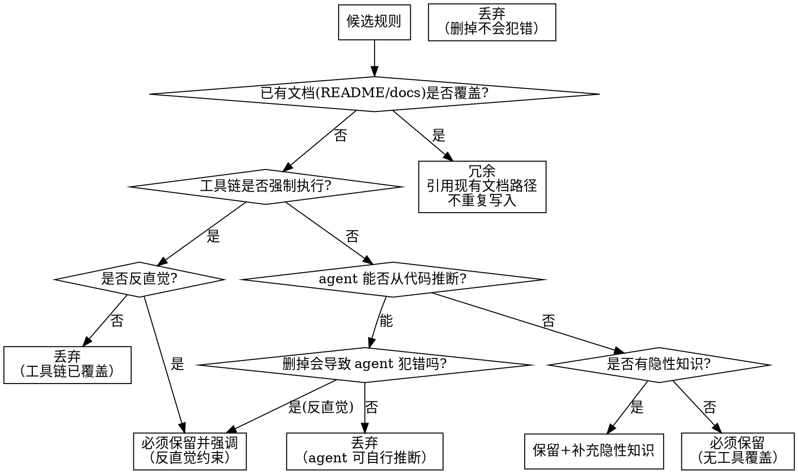

# 工具链覆盖分析方法论

> 来源：ETH Zurich ICML 2026 研究（arXiv:2602.11988）+ Anthropic Context Engineering Blog

## 核心原则

**只写 agent 无法自行推断的内容。** ETH 研究量化证实：
- LLM 生成的上下文文件平均降低成功率 3%，增加推理成本 20%+（5/8 场景成功率下降）
- 冗余是主因：移除项目已有文档后，上下文文件才显示正面效果（+2.7%）
- 架构概览段落在实验中无效 — agent 能自行发现项目结构

## 方法论

对每条候选规则，按以下决策树判定是否写入 CLAUDE.md：

## 判定标准

### 文档冗余判定（新增）

以下内容视为"已有文档覆盖"，**不写入 CLAUDE.md，改为引用路径**：

| 已有文档 | 覆盖范围 | 处理方式 |
|----------|---------|---------|
| README.md | 项目概述、技术栈、安装步骤、架构说明 | 不重复，CLAUDE.md 中可写 "详见 README.md" |
| docs/ 目录 | API 文档、架构决策记录、贡献指南 | 不重复，引用路径 |
| CONTRIBUTING.md | 开发流程、PR 规范 | 不重复 |
| 代码注释 | 复杂逻辑说明、TODO 列表 | 不提取到 CLAUDE.md |
| CI 配置文件 | 构建/测试/部署流程 | 不重复，命令表可引用 "CI 流程见 .github/workflows/" |

**关键洞察（ETH 研究）：** 删除已有文档后 LLM 生成的上下文文件才有正面效果。冗余内容不仅无益，还增加推理成本并降低成功率。

### 工具链强制执行

以下情况视为"工具链已覆盖"：

| 工具类型 | 覆盖范围 | 示例 |
|----------|---------|------|
| Formatter（Ruff format/Prettier/rustfmt） | 代码风格、缩进、引号、行宽 | "使用双引号" → 已覆盖 |
| Linter（Ruff/ESLint/golangci-lint/clippy） | 代码质量、反模式、安全规则 | "禁止未使用导入" → 已覆盖 |
| Type Checker（MyPy/TypeScript strict） | 类型注解、类型安全 | "所有函数必须有类型注解" → 已覆盖 |
| Import Linter（import-linter/ArchUnit） | 分层依赖方向、模块间导入约束 | "domain 禁止导入 fastapi" → 已覆盖 |
| AST 规则（ast-grep/semgrep） | AST 级别的模式禁止 | "禁止 async def" → 已覆盖 |
| 自定义质量门禁 | 项目特有约束 | "DI 禁止直接实例化" → 已覆盖 |

### 反直觉判定

即使有工具覆盖，以下情况仍需写入 CLAUDE.md：
- 与该语言/框架的常见做法相反（如 FastAPI 项目全同步）
- 新人容易违反的隐性约定
- 存在特定豁免但有一般性禁止（如"禁止 async"但 lifespan 豁免）

### 最小充分性检验（新增）

对每条"必须保留"的规则，追加检验：

> **"删掉这条规则，agent 会犯错吗？"**

- 不会 → 降级为"丢弃"
- 会，但犯错不影响项目质量 → 降级为"丢弃"
- 会，且影响项目质量 → 保持"必须保留"

**目的：** ETH 研究证实，上下文文件中每一行都有成本（注意力稀释 + 推理 token 增加）。每条规则都应通过"删掉会怎样"检验。

### 隐性知识判定

以下情况需要补充隐性知识：
- 规则有例外但工具未覆盖例外说明
- 规则需要与另一个维护义务同步（如新增 Provider 需同步更新列表）
- 规则的适用范围有特殊边界（如某些目录豁免）

## 输出格式

分析完成后输出覆盖分析表：

| 候选规则 | 已有文档覆盖 | 工具链覆盖 | 判定 | 理由 |
|----------|-------------|-----------|------|------|
| Python >= 3.12 | pyproject.toml | — | 冗余 | 版本声明已覆盖，引用 pyproject.toml |
| async 禁止 | — | ast-grep | 必须强调 | 反直觉：FastAPI 项目全同步 |
| 全局 Final | — | 质量门禁 GLOBAL-001 | 保留+补充 | 含缓存豁免隐性知识 |
| DI 注入 | — | 质量门禁 DI-001 | 保留+补充 | 含 PROHIBITED_INSTANTIATION 同步义务 |
| 异常三阶段 | — | — | 必须保留 | 无工具覆盖，删掉会导致三层异常混乱 |
| 项目架构概览 | README.md | — | 冗余 | README 已覆盖，agent 可自行发现 |

用户确认后进入结构设计阶段。
