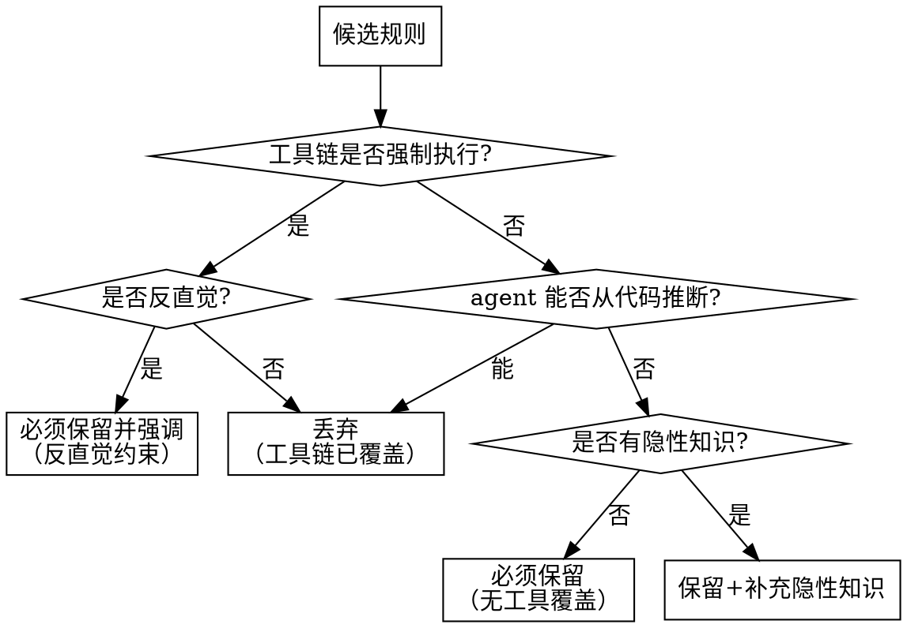

# 工具链覆盖分析方法论

> 来源：ETH Zurich ICML 2026 研究（arXiv:2602.11988）核心结论 — 只写 agent 无法自行推断的内容。

## 方法论

对每条候选规则，按以下决策树判定是否写入 CLAUDE.md：

## 判定标准

### 工具链强制执行

以下情况视为"工具链已覆盖"：

| 工具类型 | 覆盖范围 | 示例 |
|----------|---------|------|
| Formatter（Ruff format/Prettier/rustfmt） | 代码风格、缩进、引号、行宽 | "使用双引号" → 已覆盖 |
| Linter（Ruff/ESLint/golangci-lint/clippy） | 代码质量、反模式、安全规则 | "禁止未使用导入" → 已覆盖 |
| Type Checker（MyPy/TypeScript strict） | 类型注解、类型安全 | "所有函数必须有类型注解" → 已覆盖 |
| Import Linter（import-linter/ArchUnit） | 分层依赖方向、模块间导入约束 | "domain 禁止导入 fastapi" → 已覆盖 |
| AST 规则（ast-grep/semgrep） | AST 级别的模式禁止 | "禁止 async def" → 已覆盖 |
| 自定义质量门禁 | 项目特有约束 | "DI 禁止直接实例化" → 已覆盖 |

### 反直觉判定

即使有工具覆盖，以下情况仍需写入 CLAUDE.md：
- 与该语言/框架的常见做法相反（如 FastAPI 项目全同步）
- 新人容易违反的隐性约定
- 存在特定豁免但有一般性禁止（如"禁止 async"但 lifespan 豁免）

### 隐性知识判定

以下情况需要补充隐性知识：
- 规则有例外但工具未覆盖例外说明
- 规则需要与另一个维护义务同步（如新增 Provider 需同步更新列表）
- 规则的适用范围有特殊边界（如某些目录豁免）

## 输出格式

分析完成后输出覆盖分析表：

| 候选规则 | 覆盖工具 | 判定 | 理由 |
|----------|---------|------|------|
| Python >= 3.12 | pyproject.toml | 丢弃 | 版本声明已覆盖 |
| async 禁止 | ast-grep | 必须强调 | 反直觉：FastAPI 项目全同步 |
| 全局 Final | 质量门禁 GLOBAL-001 | 保留+补充 | 含缓存豁免隐性知识 |
| DI 注入 | 质量门禁 DI-001 | 保留+补充 | 含 PROHIBITED_INSTANTIATION 同步义务 |
| 异常三阶段 | 无 | 必须保留 | 无工具覆盖，纯约定 |

用户确认后进入结构设计阶段。
